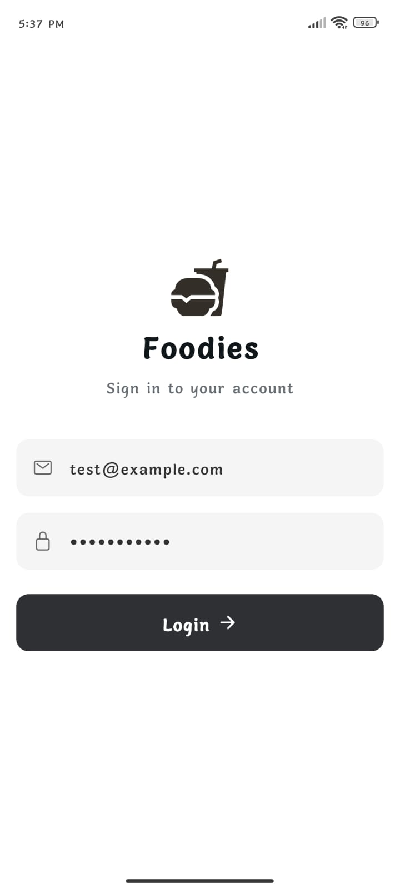
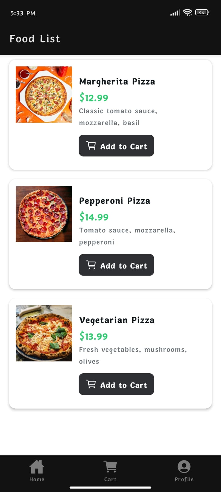
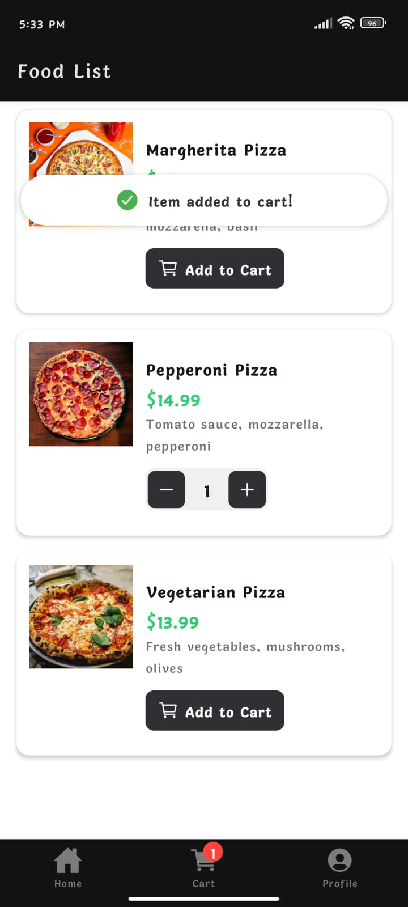
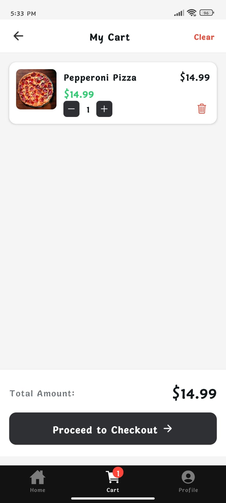
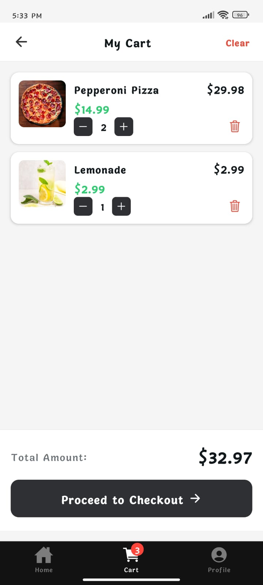
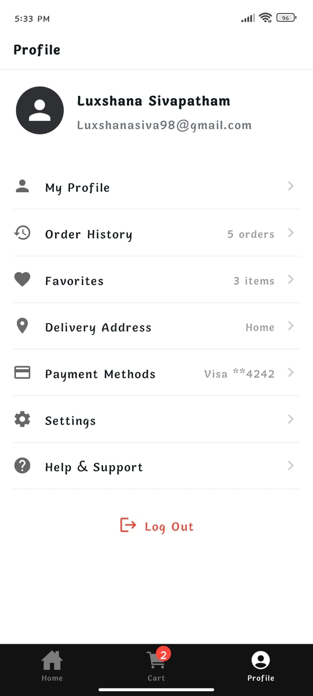

#  Mobile App

## Screens

| Screen | Description |
|---|---|
| **Home** | Browse food categories with real-time search |
| **Food List** | View items within a selected category |
| **Cart** | Review and manage order items |
| **Profile** | View and manage user account |
| **Login** | Authentication screen |

---

## Screenshots

<div align="center">
  <h3>Authentication & Home</h3>
  
  
  
  
  <h3>Ordering Flow</h3>
  
  
  
  
  <h3>Management</h3>
  
  
</div>

---

---

## Setup Instructions

### Prerequisites

Make sure the following are installed on your machine:

- [Node.js](https://nodejs.org/) (v18 or later recommended)
- [npm](https://www.npmjs.com/) (comes with Node.js)
- [Expo CLI](https://docs.expo.dev/get-started/installation/) — install globally:
  ```bash
  npm install -g expo-cli
  ```

- **For Android** — Android Studio with an emulator, or [Expo Go](https://expo.dev/client) on a physical device


### Installation

1. **Clone the repository**
   ```bash
   git clone https://github.com/luxshana/Mobile_app.git
   cd Mobile_app
   ```

2. **Install dependencies**
   ```bash
   npm install
   ```

3. **Start the development server**
   ```bash
   npm start
   ```
   This opens the Expo Dev Tools in your browser. From there, choose to run on:
   - **Android emulator / device** — press `a`
   - **iOS simulator / device** — press `i` *(macOS only)*
   - **Web browser** — press `w`

   Alternatively, scan the QR code with the **Expo Go** app on your physical device.

---

### Platform-Specific Commands

```bash
# Android
npm run android

# iOS
npm run ios

# Web
npm run web
```

---

### Lint

```bash
npm run lint
```

---


